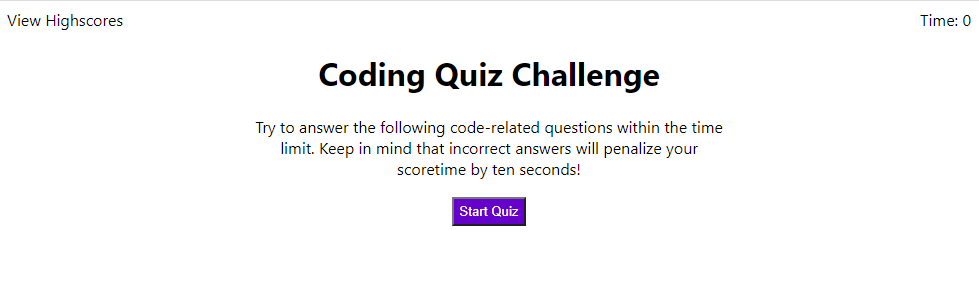
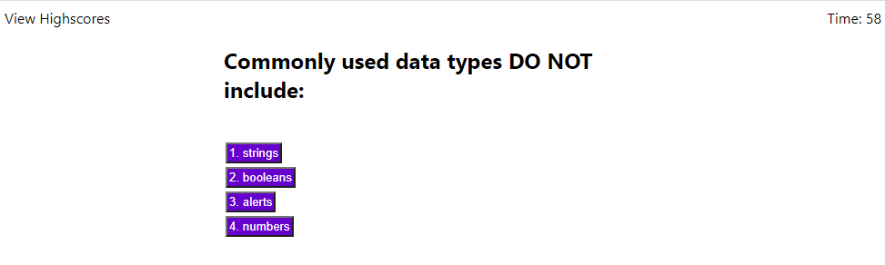
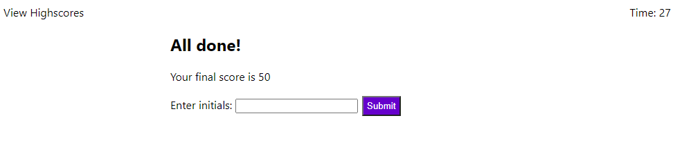
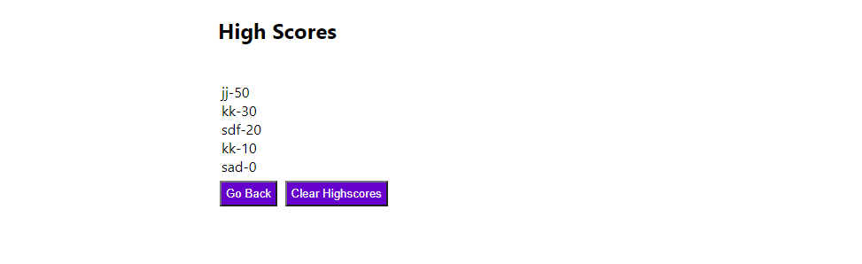

# Bootcamp Homework 04 - Web APIs: Code Quiz

## My Code Quiz

This is an assignment to build a timed coding quiz with multiple-choice questions.  Requirements for the quiz include using JavaScript to dynamically update HTML and CSS, along with a clean, polished and responsive user interface.  The quiz should utilize a timer that starts when the user is presented with a question, with time subtracted for incorrect answer selections.  When the game is over the user can save the score along with their initials.  A high scores list is available for display.      

### Homework Deliverables and Codebase Updates

* Created `index.html`, `script.js`, and `style.css` files
* Added header and div elements to the html that are dynamically hidden or unhidden based on the quiz flow
* Header contains both a timer display and a link to the High Scores view
* Quiz begins with an onclick event from the "Start Quiz" button
* Questions display one at a time with 4 multiple choice answer buttons
    * On click of the button:
        * Score is incremented if answer is correct
        * Timer is decremented if answer is incorrect
* When all questions have been answered, or Time = 0, an All Done screen displays
    * User's score is displayed
    * User can submit initials to store the score
* High Scores screen is available via a click event from the header of the Start or Quiz Question screens, or when a user's initials are entered from the All Done screen
    * Screen displays a list of the top 5 high scores
    * User can clear the High Scores list via the "Clear Highscores" button
    * User can go back to the Start screen via the "Go Back" button
* Created a README.md file to describe and demo the code
* Deployed the application to a live URL

### Notes on this project

* I believe this Code Quiz application satisfies all Acceptance Criteria.  However, the mock-up animation displays either a "Correct" or "Wrong" result to the user on selection of an answer button.  I did not implement this functionality.  Mostly, this was due to time constraints. 
* The High Scores display needs some styling.  The indvidual score rows need some additional formatting to display them in a numbered list, and to add some background color to each high score entry.  
* With this project, I feel I have reached a point where my code works and I am not always sure why.  Google was my best friend on this project.

## Screenshots

The following images show the Code Quiz appearance and functionality:

  

  

  

  

## Application URL
* [Code Quiz](https://thorgriffs.github.io/code-quiz/)